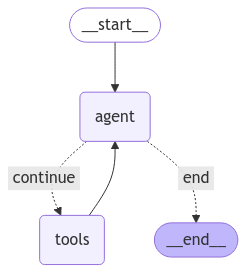

# Doraemon Agent 🤖

<div align="center">
  
</div>

Doraemon Agent is an innovative AI tool inspired by [Umar Jamil's tweet](https://x.com/hkproj/status/1882062441628254688). 


Just like the beloved character Doraemon who pulls out gadgets from his pocket, this agent can dynamically create, save, and utilize its own tools when needed.

The agent leverages LangChain's capabilities to:
- Create custom tools on-the-fly based on requirements
- Save tools as LangChain components for future use
- Utilize a wide range of language models through LangChain's integrations


## 🚀 Getting Started

### Installation

```bash
git clone https://github.com/g-hano/Doraemon-Agent.git
cd Doraemon-Agent
pip install -r requirements.txt
```

### Usage

https://github.com/user-attachments/assets/e71a74d8-1673-48e1-b737-3f88d4c963de


There are two ways to use Doraemon Agent:

1. Using the Jupyter Notebook:
```bash
jupyter notebook doraemon-agent.ipynb
```

2. Using the Command Line:
```bash
python doraemon.py --llm-type ollama --model-name "qwen2.5:14b" --query "What is 123.5 multiplied by 3212?"
```

## 🔧 Supported Models

Doraemon Agent is compatible with various language models through LangChain:
- Ollama
- Hugging Face
- OpenAI
- Anthropic
- And more!

## 🛠️ Workflow

<div align="center">
  
</div>


## 🤝 Contributing

Contributions are welcome! Feel free to submit issues and pull requests.

---
*Note: This project is not affiliated with the Doraemon franchise. The name is used as a metaphor for the tool's capabilities.*
